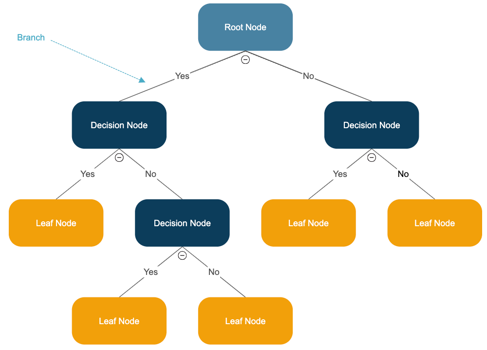

# Decision Tree Regression

A Decision Tree Regression model approximates the target by recursively partitioning the feature space and predicting the mean value in each partition. It captures nonlinear relationships and interactions and is interpretable via its tree structure.

### Mathematical Explanation

The model partitions the input space into M disjoint regions R₁, R₂, …, Rₘ and predicts a constant value cₘ for any feature vector x that falls in region Rₘ.

Predicted value = ∑ₘ [cₘ · 1(x ∈ Rₘ)].

Each region is defined by binary splits on feature values. cₘ is the average target of training samples within Rₘ. Splits are chosen to minimize the sum of squared errors in the resulting child nodes.

---

## Task

We build a Decision Tree Regression model to predict diamond prices (`price`) by:  
1. Loading the Kaggle “Diamonds Price Dataset”  
2. Cleaning data  
3. Encoding categorical features (`cut`, `color`, `clarity`)  
4. Splitting into train/test sets  
5. Training `DecisionTreeRegressor` on `price`  
6. Computing MSE, MAE, R²; visualizing residuals; actual vs predicted scatter; feature importances  

---

## Dataset & Features

Diamonds Price Dataset  
- Source: Kaggle (amirhosseinmirzaie/diamonds-price-dataset)  
- File: `diamonds.csv` (~54 k rows)  

Features used:  
- `carat` (weight in carats)  
- `cut` (quality of cut: Fair → Ideal)  
- `color` (color rating: D → J)  
- `clarity` (clarity rating: I1 → IF)  
- `depth` (total depth % = z / mean(x, y))  
- `table` (width of top surface % of widest point)  
- `x` (length in mm)  
- `y` (width in mm)  
- `z` (height in mm)  

Target:  
- `price` (price in US dollars)  

---

## Libraries  
- pandas — data loading & manipulation  
- numpy — numerical operations  
- scikit-learn — `DecisionTreeRegressor`, `OneHotEncoder`/`pd.get_dummies`, `train_test_split`, evaluation metrics  
- matplotlib — plotting residuals, actual vs predicted, feature importances  
