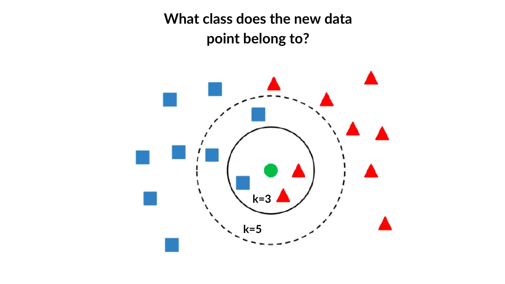
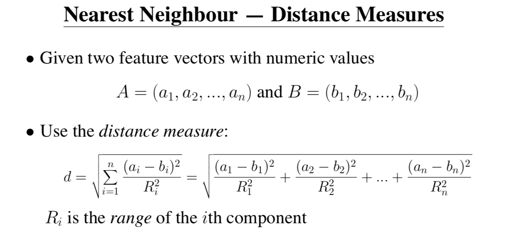

## K-Nearest Neighbors (KNN)
KNN finds the `k` training points closest to a query (using a chosen distance metric, e.g. Euclidean), then for classification predicts the most frequent label among those neighbors and for regression returns their average value.  

---
## Mathematical Explanation (KNN)



# Uber Fare Prediction with K-Nearest Neighbors Regression

This repository contains a Jupyter notebook demonstrating how to predict Uber trip fares in New York City using a K-Nearest Neighbors (KNN) regression model. The pipeline covers data loading, feature engineering, model training, hyperparameter tuning, evaluation, and visualization—all in a single interactive notebook.


## Project Structure

```
uber-knn-fare-prediction/
├── data/
│   └── uber.csv                 # Raw Uber rides data CSV
├── notebooks/
│   └── KNN_Uber_Fare.ipynb      # Jupyter notebook with full KNN fare-prediction analysis
└── README.md                    # Documentation (this file)
```

---

## Getting Started

1. **Clone the repository**

   ```bash
   git clone https://github.com/yourusername/uber-knn-fare-prediction.git
   cd uber-knn-fare-prediction
   ```
2. **Install dependencies**

   ```bash
   pip install pandas numpy matplotlib scikit-learn jupyter
   ```
3. **Prepare the data**

   * Place `uber.csv` in the `data/` directory.  This CSV should include at least:

     * `fare_amount`
     * `pickup_datetime`
     * `pickup_longitude`, `pickup_latitude`
     * `dropoff_longitude`, `dropoff_latitude`
     * `passenger_count`

---

## Notebook Workflow

The notebook (`KNN_Uber_Fare.ipynb`) is organized into the following labeled sections:

1. **Imports**
   Load essential libraries: `pandas`, `numpy`, `matplotlib`, and Scikit-Learn modules.

2. **Data Loading & Preview**
   Read `uber.csv` into a DataFrame and display the first few rows.

3. **Feature Engineering**

   * Convert `pickup_datetime` into separate `hour`, `weekday`, and `month` features.
   * Compute trip distance (in kilometers) using the Haversine formula.
   * Create boolean flags: `is_weekend` and `morning_peak`.
   * Build an interaction feature: `distance_km * passenger_count`.
   * Apply a log transform to the target fare (`fare_log`).

4. **Data Cleaning**

   * Remove trips with zero or negative distance/fare.
   * Clip distance and fare at the 99th percentile to mitigate extreme outliers.

5. **Train/Test Split**

   * Split the dataset into 80% training and 20% testing sets.
   * Features used: `['passenger_count', 'distance_km', 'hour', 'weekday', 'month', 'is_weekend', 'morning_peak', 'dist_x_pass']`
   * Targets: `fare_log` for training, original `fare_amount` for final evaluation.

6. **Pipeline & Hyperparameter Tuning**

   * Define a `ColumnTransformer` to standardize numeric features.
   * Construct a `Pipeline` combining the preprocessor with a `KNeighborsRegressor`.
   * Conduct a grid search (`GridSearchCV`) over:

     * `n_neighbors`: \[5, 10, 15, 20, 25]
     * `weights`: \["uniform", "distance"]
     * `p` (Minkowski power): \[1, 2]
   * Optimize for negative mean absolute error (MAE) with 3-fold cross-validation.

7. **Evaluation**

   * Apply the best model to the test set.
   * Compute metrics: Mean Squared Error (MSE), Mean Absolute Error (MAE), R² score, and percentage of predictions within ±\$4 of actual fare.

8. **Visualizations**

   * Plot a histogram of trip distances.
   * Scatter plot of Actual vs. Predicted fares with a reference y=x line.

---

## Results & Interpretation

* **Optimal hyperparameters** (example):

  ```text
  n_neighbors=10
  weights='distance'
  p=2
  ```
* **Test performance** (example):

  * MSE: 20.34
  * MAE: 3.42
  * R²: 0.79
  * ±\$4 accuracy: 86.7%

> The KNN regressor captures the majority of fare variability (R² ≈0.8) and predicts within \$4 of the true fare for roughly 87% of trips.

