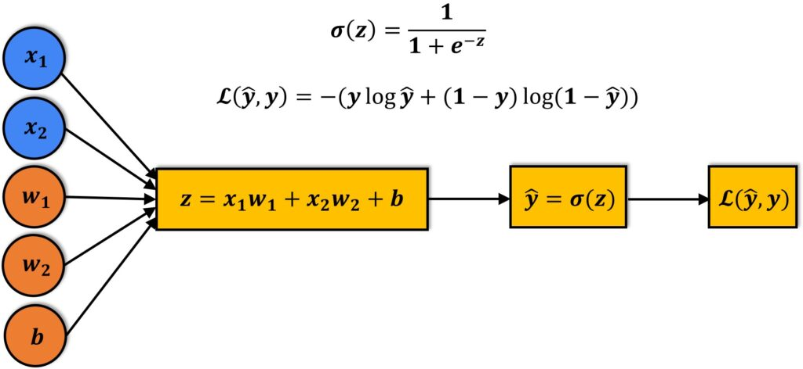
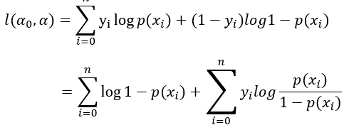

## Logistic Regression

Logistic Regression fits a weighted sum of input features, applies the sigmoid function to map that sum to a probability between 0 and 1, and then classifies as positive if the probability ≥ 0.5 and negative otherwise.  


## Mathematical Explanation



# Flight Delay Classification with Logistic Regression & SMOTE

This repository contains a Jupyter notebook demonstrating how to classify flight delays using a multinomial logistic regression model combined with SMOTE upsampling to address class imbalance. The pipeline covers data loading, feature selection, preprocessing, resampling, model training, evaluation, and visualization—all in one interactive notebook.

---

## Project Structure

```
flight-delay-classification/
├── data/
│   └── Cleaned_dataset.csv           # Preprocessed flights dataset
├── notebooks/
│   └── flight_delay_classification.ipynb  # Jupyter notebook with full classification workflow
└── README.md                         # Documentation (this file)
```

---

## Getting Started

1. **Clone the repository**

   ```bash
   git clone https://github.com/yourusername/flight-delay-classification.git
   cd flight-delay-classification
   ```
2. **Install dependencies**

   ```bash
   pip install pandas numpy matplotlib seaborn scikit-learn imbalanced-learn jupyter
   ```
3. **Prepare the data**

   * Place `Cleaned_dataset.csv` in the `data/` directory.  It should include columns such as `Flight_code`, `Duration_in_hours`, `Days_left`, `Fare`, `Journey_day`, `Airline`, `Source`, `Departure`, `Total_stops`, `Arrival`, `Destination`, and `Class`.

---

## Notebook Workflow

The notebook (`flight_delay_classification.ipynb`) is organized into labeled sections:

1. **Imports & Settings**
   Load libraries (`pandas`, `numpy`, `matplotlib`, `seaborn`, Scikit-Learn, Imbalanced-Learn) and configure plotting.

2. **Data Loading & Preview**
   Read `Cleaned_dataset.csv` into a DataFrame and display the first few rows and class distribution.

3. **Features & Target**

   * Drop identifier column `Flight_code`
   * Target variable: `Class`
   * Numeric features: `Duration_in_hours`, `Days_left`, `Fare`
   * Categorical features: `Journey_day`, `Airline`, `Source`, `Departure`, `Total_stops`, `Arrival`, `Destination`

4. **Preprocessing Pipeline**
   Use a `ColumnTransformer` to:

   * Standard-scale numeric features
   * One-hot encode categorical features (dropping the first level)

6. **Train/Test Split**
   Perform an 80/20 split to preserve class proportions.

7. **Model Training & Prediction**
   Fit the pipeline on the training data and generate predictions on the test set.

8. **Evaluation**

   * Print a classification report (precision, recall, F1-score).
   * Plot a confusion matrix heatmap.

---

## Next Steps
* Compare against other classifiers (Random Forest, XGBoost) in the same pipeline.
* Deploy the trained model as a REST API for real-time predictions.
---

