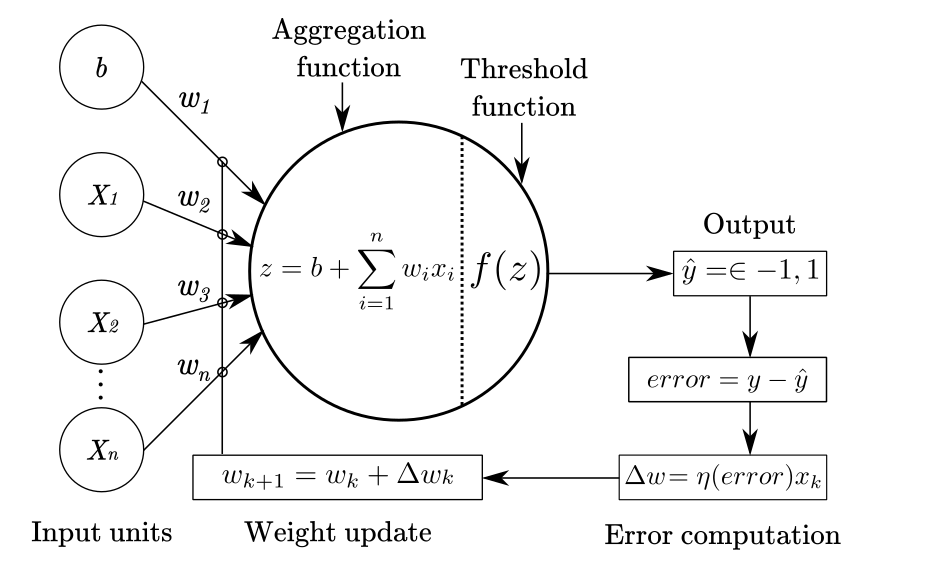

## Perceptron

The Perceptron computes a weighted sum of input features plus a constant term and assigns one of two classes depending on whether that sum is non-negative or negative. During training, whenever it misclassifies an example, it adjusts each weight and the constant by adding or subtracting a small fraction (the learning rate) of the input values, gradually moving the decision boundary to correct the errors.
---

## Mathematical Explanation



# Diamond Carat Classification with Perceptron

This project trains a Perceptron classifier to predict whether a diamond's carat weight exceeds 0.5 ct, using both numerical and categorical features with careful preprocessing and hyperparameter tuning.


## Repository Structure

```plaintext
.
├── data/
│   └── diamond-prices.csv      # Raw dataset: carat, cut, color, clarity, depth, table, price, x, y, z
├── DiamondCaratClassification.ipynb  # Jupyter notebook with full analysis
└── README.md                   # Project documentation (this file)
```

---

## Getting Started

1. **Clone the repository**

   ```bash
   git clone https://github.com/yourusername/diamond-perceptron.git
   cd diamond-perceptron
   ```

2. **Install dependencies**

   ```bash
   pip install -r requirements.txt
   ```

   **Required packages:**

   * pandas
   * numpy
   * scikit-learn
   * jupyter

3. **Prepare the data**

   * Ensure `data/diamond-prices.csv` exists with columns:

     ```csv
     carat,cut,color,clarity,depth,table,price,x,y,z
     0.23,Ideal,E,SI2,61.5,55.0,326,3.95,3.98,2.43
     ...
     ```

---

## Usage

1. **Launch the notebook**

   ```bash
   jupyter notebook DiamondCaratClassification.ipynb
   ```
2. **Run all cells** in order. The notebook performs:

   * Data loading and target creation (`carat > 0.5` → binary label)
   * Train/test split (80/20, stratified)
   * Preprocessing pipelines:

     * **Numeric features:** StandardScaler → PolynomialFeatures(degree=2)
     * **Categorical features:** OrdinalEncoder with fixed orderings for `cut`, `color`, `clarity`
   * Pipeline assembly and 5‑fold GridSearchCV over the Perceptron’s hyperparameters:

     * `penalty`, `alpha`, `eta0`, `max_iter`, `tol`
   * Reporting of best CV accuracy and hyperparameters
   * Final evaluation on the held‑out test set with a classification report and confusion matrix

---

## Analysis Steps

1. **Load Data & Create Target**
   Read `diamond-prices.csv`, then build `target = (carat > 0.5).astype(int)`.

2. **Train/Test Split**
   80% training, 20% test, stratified by the binary target.

3. **Preprocessing**

   * *Numeric columns* → `StandardScaler` → `PolynomialFeatures(degree=2)` to capture nonlinearities and interactions.
   * *Categorical columns* (`cut`, `color`, `clarity`) → `OrdinalEncoder` preserving natural quality orderings.

4. **Model & Hyperparameter Tuning**

   * Wrap preprocessing + `Perceptron` in a `Pipeline`.
   * Use `GridSearchCV` (5 folds) to tune:

     * `penalty` ∈ {None, l2, l1, elasticnet}
     * `alpha` ∈ {1e-4, 1e-3, 1e-2}
     * `eta0` ∈ {1.0, 0.1, 0.01}
     * `max_iter` ∈ {500, 1000}
     * `tol` ∈ {1e-3, 1e-4}

5. **Evaluation**

   * Print best CV accuracy and corresponding hyperparameters.
   * On the test set, display the classification report (precision, recall, F1) for classes “≤ 0.5 ct” vs “> 0.5 ct”.
   * Show the confusion matrix.

---

## License

This project is licensed under the MIT License. Feel free to reuse and adapt.

---
