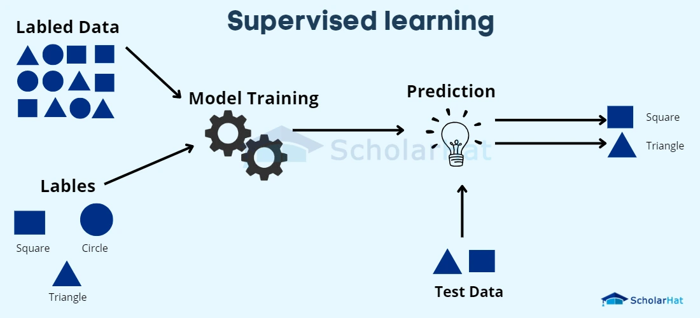

# Supervised Learning Models

## Table of Content

* [Introduction](#introduction)
* [How Supervised Learning Works](#how-supervised-learning-works)
* [Decision Tree](#decision-tree)
* [Gradient Boosting](#gradient-boosting)
* [K Means Clustering](#k-means-clustering)
* [K Nearest Neighbors](#k-nearest-neighbors)
* [Linear Regression](#linear-regression)
* [Logistic Regression](#logistic-regression)
* [Neural Network](#neural-network)
* [Perceptron](#perceptron)
* [Random Forest](#random-forest)
* [Challenges](#challenges)
* [References](#references)

---

## Introduction  

Supervised learning uses labeled data (features with known targets) to train models that can predict outcomes on new, unseen inputs. It encompasses tasks where the goal is to infer a mapping function from input features to output targets, enabling either classification or regression.

---

## How Supervised Learning Works  

1. **Data Collection & Labeling**: Gather input–output pairs and split into training/test sets.
2. **Preprocessing**: Handle missing values, outliers, scaling, and encoding.
3. **Model Training**: Fit a chosen algorithm to minimize a loss function on the training set.
4. **Evaluation**: Assess performance on the test set using appropriate metrics.
5. **Hyperparameter Tuning**: Optimize model parameters (e.g., tree depth, learning rate) via grid search or other search strategies.

---

## Decision Tree  

A tree-based model that splits data recursively on feature thresholds, creating a hierarchy of binary decisions. Leaves output class labels (classification) or average target values (regression).

---

## Gradient Boosting  

An ensemble technique that trains models sequentially, each new model fitting to the residual errors of the previous ensemble. Commonly uses decision trees as weak learners to optimize a differentiable loss.

---

## K Means Clustering  

An unsupervised algorithm that partitions data into k clusters by minimizing within-cluster variance. Iteratively assigns points to the nearest centroid and updates centroids until convergence.

---

## K Nearest Neighbors  

A non-parametric method that predicts targets based on the k closest training samples in feature space—averaging values for regression or majority voting for classification.

---

## Linear Regression  

Models the relationship between input features and a continuous target as a weighted sum of features. Coefficients are learned by minimizing the sum of squared residuals (least squares).

---

## Logistic Regression  

A linear model for binary classification that applies the logistic (sigmoid) function to map weighted inputs to probabilities. Parameters are learned by maximizing the log-likelihood of observed labels.

---

## Neural Network  

A collection of interconnected layers of neurons with non-linear activation functions. Uses backpropagation to minimize loss, learning complex, non-linear mappings from inputs to outputs.

---

## Perceptron  

A single-layer neural unit for binary classification. Updates its weight vector iteratively on misclassified examples using a step activation function to adjust the decision boundary.

---

## Random Forest  

An ensemble of decision trees trained on bootstrap samples and random feature subsets. Aggregates predictions by averaging (regression) or majority voting (classification) to reduce overfitting.

---

## Challenges  

* **Overfitting**: Models may memorize training data and fail to generalize.
* **Data Quality**: Missing values, outliers, and noisy labels can degrade performance.
* **Bias–Variance Tradeoff**: Balancing model complexity and generalization.
* **Computational Cost**: Some algorithms scale poorly with data size (e.g., KNN).
---

