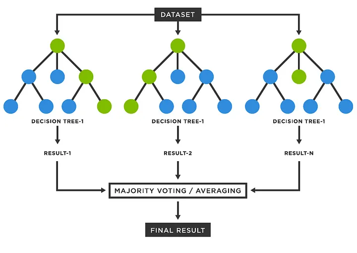

## Random Forest

Random Forest builds many decision trees, each trained on a random subset of the data and a random subset of features at each split. For classification, it predicts the class that the majority of trees vote for; for regression, it averages the trees’ outputs. By combining multiple decorrelated trees, it reduces overfitting and boosts overall accuracy.
---

## Mathematical Explanation

A Random Forest is an ensemble of M decision trees {hₘ(x)}ₘ=₁ᴹ, each trained on a bootstrap sample and a random subset of features. It reduces variance by averaging many decorrelated trees.  


1. **Individual tree**  
   Each tree $h_m(x)$ partitions the feature space into regions $\{R_{m,\ell}\}_{\ell=1}^{L_m}$ and predicts a constant $c_{m,\ell}$ on each region:  
   $$
     h_m(x) = \sum_{\ell=1}^{L_m} c_{m,\ell}\,\mathbf{1}\bigl(x \in R_{m,\ell}\bigr).
   $$

2. **Regression aggregation**  
   $$
     \hat y 
     = \frac{1}{M}\sum_{m=1}^M h_m(x).
   $$

3. **Classification aggregation**  
   $$
     \hat y 
     = \arg\max_{c}\sum_{m=1}^M \mathbf{1}\bigl(h_m(x)=c\bigr).
   $$

4. **Variance reduction**  
   If each tree has variance $\sigma^2$ and average pairwise correlation $\rho$, then  
   $$
     \mathrm{Var}(\hat y)
     = \frac{\sigma^2}{M}\bigl[1 + (M-1)\rho\bigr]
     = \rho\,\sigma^2 + \frac{1-\rho}{M}\,\sigma^2,
   $$  
   showing that low correlation ($\rho$) and large $M$ reduce overall variance.

# Diamond Price Prediction with Random Forest

This repository contains a Jupyter notebook demonstrating how to predict diamond prices using a Random Forest Regressor wrapped in a log-target transform and true-order ordinal encoding. The workflow covers data loading, feature engineering, preprocessing, hyperparameter tuning via successive halving, model evaluation, and visual diagnostics—all in one interactive notebook.


## Project Structure

```
diamond-price-prediction/
├── data/
│   └── diamond-prices.csv             # Raw diamond dataset
├── notebooks/
│   └── diamond_price_prediction.ipynb # Jupyter notebook with full workflow
├── pipeline_cache/                     # Cached transformers (optional)
└── README.md                          # Documentation (this file)
```

---

## Getting Started

### 1. Clone the repository

```bash
git clone <repository-url>
cd diamond-price-prediction
```

### 2. Install dependencies

```bash
pip install pandas numpy matplotlib scikit-learn jupyter
```

### 3. Prepare the data

Place `diamond-prices.csv` in the `data/` directory. The file should include columns:
`carat, cut, color, clarity, depth, table, price, x, y, z`.

---

## Notebook Workflow

Open `notebooks/diamond_price_prediction.ipynb` and run the sections sequentially:

1. **Imports & Settings**  
   Load all necessary libraries (`pandas`, `numpy`, `matplotlib`, `scikit-learn`).

2. **Data Loading**  
   Read `diamond-prices.csv`, verify existence, and preview the first rows.

3. **Feature Engineering**  
   - Compute `volume = x * y * z`  
   - Compute `carat_depth_ratio = carat / depth`

4. **Train/Test Split**  
   Split data into 80% train and 20% test sets.

5. **Preprocessing Pipeline**  
   Use a `ColumnTransformer` to:
   - Standard-scale numerical features  
   - Ordinal-encode `cut`, `color`, and `clarity` in their true quality order

6. **Modeling & Hyperparameter Search**  
   - Wrap the preprocessing + `RandomForestRegressor` in a `TransformedTargetRegressor` for a log1p target transform  
   - Run `HalvingGridSearchCV` over RF hyperparameters (`n_estimators`, `max_depth`, `min_samples_split`)

7. **Evaluation**  
   - Compute MAE, RMSE, R², and MAPE on the hold-out test set  
   - Print final performance metrics

8. **Diagnostic Plots**  
   - **Feature Importances** bar chart  
   - **Predicted vs Actual** scatter with parity line  
   - **Residual Distribution** histogram

---

## Example Results

A typical run yields:

- **MAE**   : 262.37  
- **RMSE**  : 525.32  
- **R²**    : 0.9821   
- **MAPE**  : 6.34%   

---
a
## Next Steps

- Experiment with additional features or alternative regression algorithms (e.g., XGBoost).  


---

## License

This project is licensed under the MIT License. Feel free to use and adapt for your own purposes.
