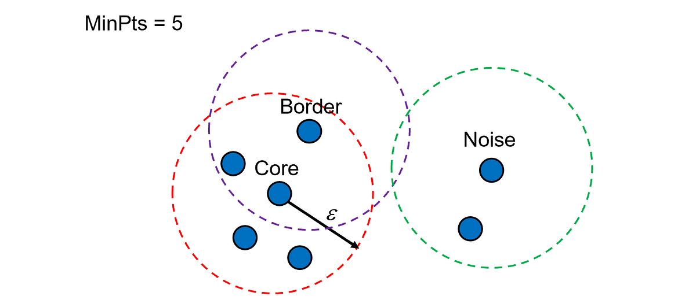

# DBSCAN Clustering

DBSCAN (Density-Based Spatial Clustering of Applications with Noise) groups points by density rather than distance to centroids. It labels as **core** any point with at least `min_samples` neighbors within radius `eps`, assigns density-reachable points to the same cluster, and marks remaining points as noise.

### Mathematical explanation  

Given data points xᵢ, DBSCAN builds clusters Cⱼ by:  
- A point xᵢ is core if |N(xᵢ, eps)| ≥ min_samples, where N(xᵢ, eps) are points within distance eps of xᵢ  
- Points within eps of any core point join its cluster (density-reachable)  
- Points not density-reachable from any core become noise (cluster = –1)  

---

## Task

We apply DBSCAN to identify meteorite landing hotspots and isolate outliers by:  
- Loading the Global Meteorite Landings dataset from Kaggle  
- Cleaning data (drop missing coordinates, parse year)  
- Engineering `fall_Found` and `fall_Fell` binary flags  
- Selecting features (`mass`, `year`, `reclat`, `reclong`, `fall_Found`, `fall_Fell`)  
- Scaling features with StandardScaler  
- Choosing `eps=2` and `min_samples=5` via k-distance plot  
- Fitting `DBSCAN(eps=2, min_samples=5)` and assigning cluster labels  
- Examining cluster counts and centroids  
- Visualizing clusters in 2D via PCA projection  

---

## Dataset & Features

Global Meteorite Landings  
- Source: Kaggle (nasa/meteorite-landings)  
- File: `meteorite_landings.csv` (~45 000 rows)  

Features used:  
- `mass` (g)  
- `year` (landing year)  
- `reclat` (latitude)  
- `reclong` (longitude)  
- `fall_Found` (1 if “Found”, 0 otherwise)  
- `fall_Fell` (1 if “Fell”, 0 otherwise)  

No target (unsupervised clustering)  

---

## Libraries

- pandas — data loading & manipulation  
- numpy — numerical operations  
- scikit-learn — `DBSCAN`, `StandardScaler`, `PCA`, `NearestNeighbors`  
- matplotlib — plotting k-distance plot and PCA scatter  
