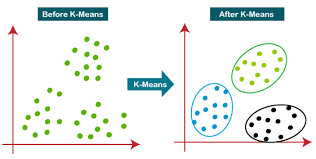

# K-Means Clustering

K-Means clustering partitions the dataset into k clusters by minimizing within-cluster variance. Each point is assigned to the nearest cluster centroid, and centroids are updated iteratively until convergence.

### Mathematical explanation  

Given data points xᵢ, centroids μⱼ and clusters Cⱼ, K-Means minimizes  
min ∑ⱼ=1…k ∑ₓᵢ∈Cⱼ ‖xᵢ – μⱼ‖²  
with μⱼ = (1/|Cⱼ|) ∑ₓᵢ∈Cⱼ xᵢ  
and each xᵢ assigned to argminⱼ ‖xᵢ – μⱼ‖.

---

## Task

We apply K-Means clustering to segment wholesale customers by spending patterns:  
- Load the Wholesale Customers dataset  
- Clean data if needed  
- Select spending features (`Fresh`, `Milk`, `Grocery`, `Frozen`, `Detergents_Paper`, `Delicassen`)  
- Scale features with StandardScaler  
- Determine optimal k via Elbow method and Silhouette analysis  
- Fit KMeans(n_clusters=k_opt) and assign cluster labels  
- Examine cluster sizes and centroids  
- Visualize clusters in 2D via PCA projection  

---

## Dataset & Features

Wholesale Customers Data  
- File: `wholesale_customers_data.csv` (440 rows, 8 columns)  
- Source: UCI / Kaggle  

Features used (numeric spending in monetary units):  
- `Fresh`  
- `Milk`  
- `Grocery`  
- `Frozen`  
- `Detergents_Paper`  
- `Delicassen`  

Columns not used for clustering:  
- `Channel`  
- `Region`  

---

## Libraries

- pandas — data loading & manipulation  
- numpy — numerical operations  
- scikit-learn — `KMeans`, `StandardScaler`, `silhouette_score`, `PCA`, `train_test_split`  
- matplotlib — plotting elbow curve, silhouette scores, PCA scatter  
