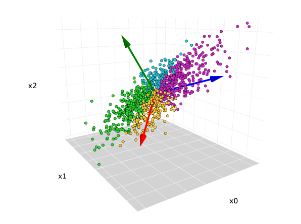
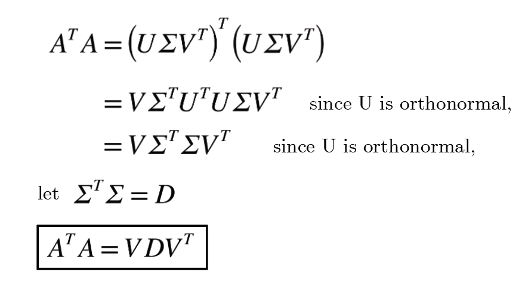

## Principal Component Analysis (PCA)

Principal Component Analysis (PCA) is a method for reducing the dimensionality of a dataset while preserving as much variability as possible. It does this by identifying new axes, called principal components, that capture the directions of greatest variance in the data. These components are linear combinations of the original features and are orthogonal to each other. PCA first centers the data, then uses techniques like eigen decomposition or singular value decomposition to find these directions. The data is then projected onto the top few principal components, resulting in a simplified version that retains the most important patterns.

## Mathematical Explanation




# PCA Analysis of Meteorite Landings

This Folder contains tools for performing Principal Component Analysis (PCA) on a meteorite landings dataset. PCA reduces the dimensionality of the data while preserving variance, allowing for both scree plots and three-dimensional visualizations of the top principal components.

## Project Structure

```
PCA/
├── PCAcode.ipynb     # Interactive Jupyter notebook performing the full analysis
├── PCA.png           # Example 3D scatter plot of the first three principal components
└── README.md         # Documentation for setup and usage
```

## Getting Started

1. **Clone the repository**

   ```bash
   git clone https://github.com/yourusername/meteorite-pca.git
   cd meteorite-pca/PCA
   ```

2. **Install dependencies**

   ```bash
   pip install -r ../requirements.txt
   ```

   Required packages include `pandas`, `numpy`, `matplotlib`, `scikit-learn`, and `openpyxl`.

3. **Prepare the data**

   * Create a `data/` directory at the root of the project.
   * Place your meteorite landings CSV file (e.g., `meteorite_landings.csv`) into `data/`.
   * Ensure the file contains numeric features such as mass, fall date, and geographic coordinates.

## Usage

### Run analysis in Jupyter Notebook

```bash
jupyter notebook PCAcode.ipynb
```

Open the notebook and execute cells interactively to:

1. Load and inspect the input data.
2. Select and clean numeric features.
3. Standardize each feature to zero mean and unit variance.
4. Fit PCA on the standardized data.
5. Generate a scree plot showing explained variance by component.
6. Create a 3D scatter plot of the first three principal components, colored by meteorite class.
7. Save the visualizations (e.g., `PCA.png`).

## Outputs

* **Scree Plot**: A bar chart showing the percentage of total variance explained by each principal component.
* **3D Scatter Plot**: A visualization of samples projected onto the first three principal components, with arrows indicating feature loadings.

## Interpretation

* A sharp decline in explained variance after the first few components indicates that most of the information is captured by those components.
* Clusters or separations in the 3D scatter may reveal grouping by meteorite classification or underlying structure in the data.

---

**Principal Component Analysis**: PCA identifies orthogonal directions in the feature space that maximize variance, facilitating dimensionality reduction and visualization with minimal loss of information.

For more details, refer to the [scikit-learn PCA documentation](https://scikit-learn.org/stable/modules/generated/sklearn.decomposition.PCA.html).
