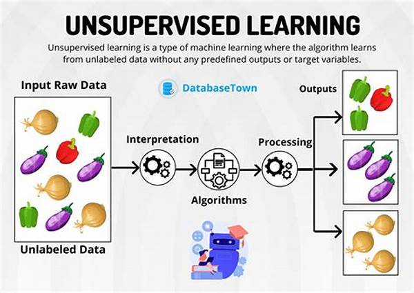

# Unsupervised Learning Models

## Table of Content

* [Introduction](#introduction)
* [How Unsupervised Learning Works](#how-unsupervised-learning-works)
* [DBSCAN](#dbscan)
* [K Means Clustering](#k-means-clustering)
* [Principal Component Analysis (PCA)](#pca)
* [Singular Value Decomposition (SVD)](#svd)
* [Challenges](#challenges)
* [References](#references)

---

## Introduction  

Unsupervised learning discovers hidden patterns or intrinsic structures in data without using labeled target variables. It is commonly used for clustering, dimensionality reduction, and anomaly detection, providing insights into data distribution and relationships.

---

## How Unsupervised Learning Works  

1. **Data Preparation**: Clean and scale features; handle missing values and normalization.
2. **Algorithm Selection**: Choose clustering or reduction technique based on goals (grouping vs. feature extraction).
3. **Model Fitting**: Apply the algorithm to learn data structure (e.g., cluster assignments or lower-dimensional representation).
4. **Evaluation**: Use internal metrics like silhouette score (clustering) or explained variance (PCA/SVD) to assess quality.
5. **Interpretation**: Visualize clusters or principal components to extract actionable insights.

---

## DBSCAN  

Density-Based Spatial Clustering of Applications with Noise (DBSCAN) groups points densely packed together, marking low-density points as outliers. It requires two parameters: ε (neighborhood radius) and min\_samples (minimum points per cluster).

---

## K Means Clustering  

Partitions data into k clusters by minimizing within-cluster sum of squares. Iteratively assigns points to the nearest centroid and updates centroids until convergence. Sensitive to initial centroids and k selection.

---

## Principal Component Analysis (PCA)  

A linear dimensionality reduction technique that projects data onto orthogonal axes (principal components) capturing maximum variance. Good for visualization, noise reduction, and speeding up downstream models.

---

## Singular Value Decomposition (SVD)  

Factorizes the data matrix into U, Σ, and Vᵀ, revealing latent factors and enabling low-rank approximation. SVD underpins PCA and is used for compression, noise reduction, and recommendation systems.

---

## Challenges  

* **Parameter Sensitivity**: Many algorithms require careful tuning (e.g., k in K Means, ε in DBSCAN).
* **Scalability**: Clustering large datasets can be computationally expensive.
* **Interpretability**: Dimensionality reduction components may lack clear semantics.
* **Cluster Validation**: No ground truth, so assessing cluster quality relies on internal metrics.

---
