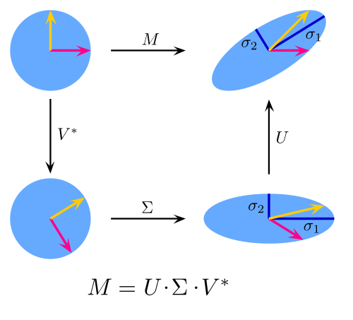

# Unsupervised SVD Analysis of Uber Pickup Data

This code performs Singular Value Decomposition (SVD) on a New York City Uber rides dataset. The analysis uncovers the principal axes of variation in features such as fare amount, pickup/dropoff locations, passenger count, and time of day, enabling dimensionality reduction, visualization, and identification of outlier rides.

## Mathematical Explanation

SVD factorizes any real matrix X ∈ ℝⁿ×ᵈ into three parts:

1. **Factorization**  
   $$
     X = U\,\Sigma\,V^T
   $$
   where  
   - U ∈ ℝⁿ×ⁿ has orthonormal columns (Uᵀ U = I),   
   - Σ ∈ ℝⁿ×ᵈ is diagonal with nonnegative singular values (σ₁ ≥ σ₂ ≥ … ≥ 0), 
   - V ∈ ℝᵈ×ᵈ has orthonormal columns (Vᵀ V = I)  

2. **Singular values**  
   The diagonal entries σᵢ of σ satisfy  
   $$
     \sigma_i = \sqrt{\lambda_i\bigl(X^T X\bigr)},
   $$
   where λᵢ(Xᵀ X) are the eigenvalues of the covariance matrix Xᵀ X.

3. **Low-rank approximation**  
   Truncate to the first \(k\) components to get the best rank-\(k\) approximation in Frobenius norm:
   $$
     X_k = U_{[:,1:k]}\,\Sigma_{1:k,1:k}\,V_{[:,1:k]}^T,\quad
     \|X - X_k\|_F = \min_{\mathrm{rank}(Y)=k}\|X - Y\|_F.
   $$

4. **Connection to PCA**  
   Projection onto the top k right-singular vectors V[:,1:k] yields the same subspace as PCA’s top k principal components.

**Notes:**  
- U gives the left-singular “directions” in sample space, V the right-singular directions in feature space. 
- σᵢ² is the variance explained by the iᵗʰ component.   
- SVD works on any rectangular matrix, not just covariance matrices.  


---

## Project Structure

```
unsupervised-learning/SVD/
├── svd_uber_code.py   # Python script to load data, compute SVD, project onto top components, and plot results
├── uber.csv           # Raw dataset of Uber rides (fare, coordinates, timestamp, passenger count)
└── README.md          # This documentation
```

## Getting Started

1. **Clone the repository**

   ```bash
   git clone https://github.com/yourusername/cmor438.git
   cd cmor438/unsupervised-learning/SVD
   ```

2. **Install dependencies**

   ```bash
   pip install pandas numpy matplotlib
   ```

3. **Prepare the data**

   * Ensure `uber.csv` is present in this directory.  It should include at least the following columns:

     * `fare_amount`
     * `pickup_latitude`, `pickup_longitude`
     * `dropoff_latitude`, `dropoff_longitude`
     * `passenger_count`
     * `pickup_datetime`

## Usage

Run the SVD analysis script:

```bash
python svd_uber_code.py
```

The script will:

1. Load the CSV data into a Pandas DataFrame.
2. Parse `pickup_datetime` and extract the hour of day.
3. Select numeric features and drop missing rows.
4. Center the data (zero mean) and convert to a NumPy matrix.
5. Compute full SVD: `X = U S V^T`.
6. Print the shapes of `U`, `S`, and `V^T`, and list the top singular values.
7. Project the data onto the first two principal components.
8. Display a scatter plot of the 2D projection.
9. Identify the three rides with the largest absolute projections along PC1 and print their original feature values.

## Outputs

* **Singular values**: Indicates how much variance each principal component captures.
* **2D Projection plot**: Scatter plot of rides in the space of the first two principal components.
* **Extreme rides**: List of the top-3 most extreme rides along the first principal component, showing potential outliers.

## Interpretation

* A steep drop in singular values suggests the first few components capture most of the dataset’s variation.
* The 2D projection reveals clusters or patterns driven by combinations of fare, location, and time.
* Extreme rides (high |PC1|) may correspond to unusual trips—high fares, long distances, or atypical times.

---

**Singular Value Decomposition (SVD)**

> SVD factorizes a data matrix into orthogonal components, revealing latent directions of maximum variance. It is widely used for dimensionality reduction, noise filtering, and pattern discovery.

For more information, see [NumPy SVD documentation](https://numpy.org/doc/stable/reference/generated/numpy.linalg.svd.html).
